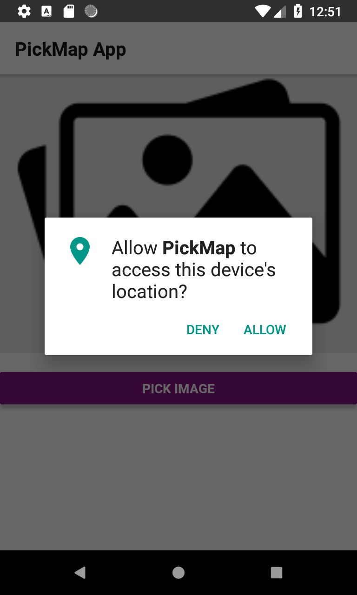
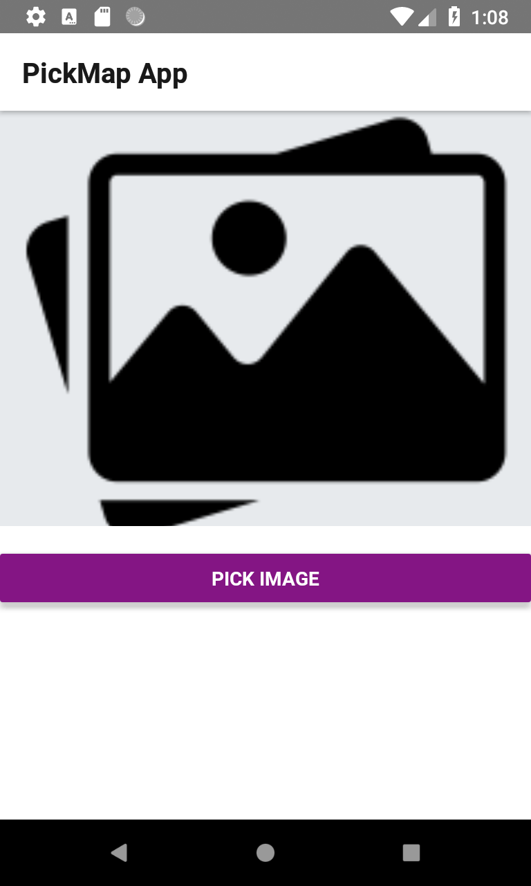
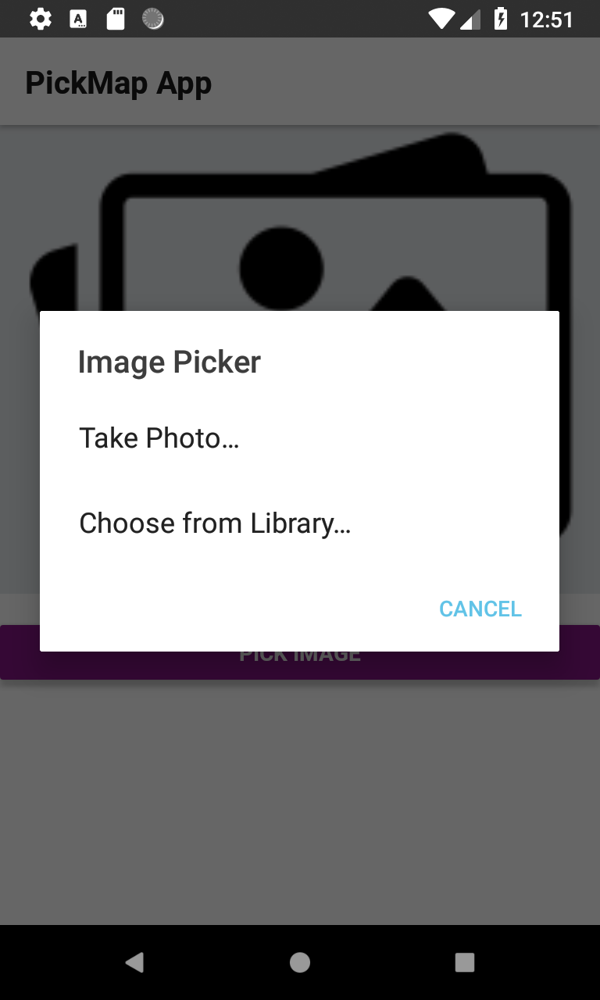
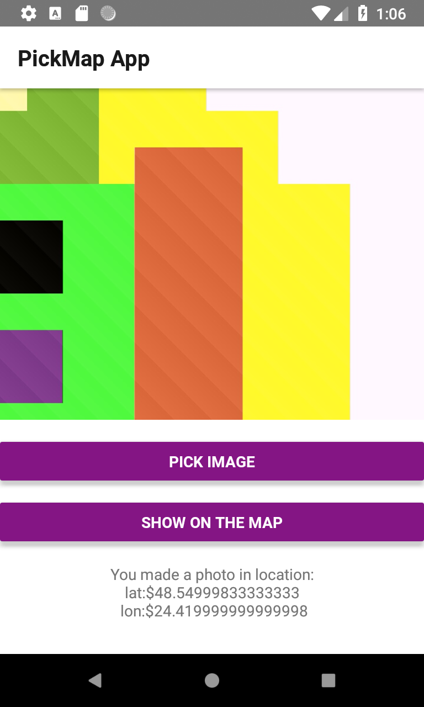
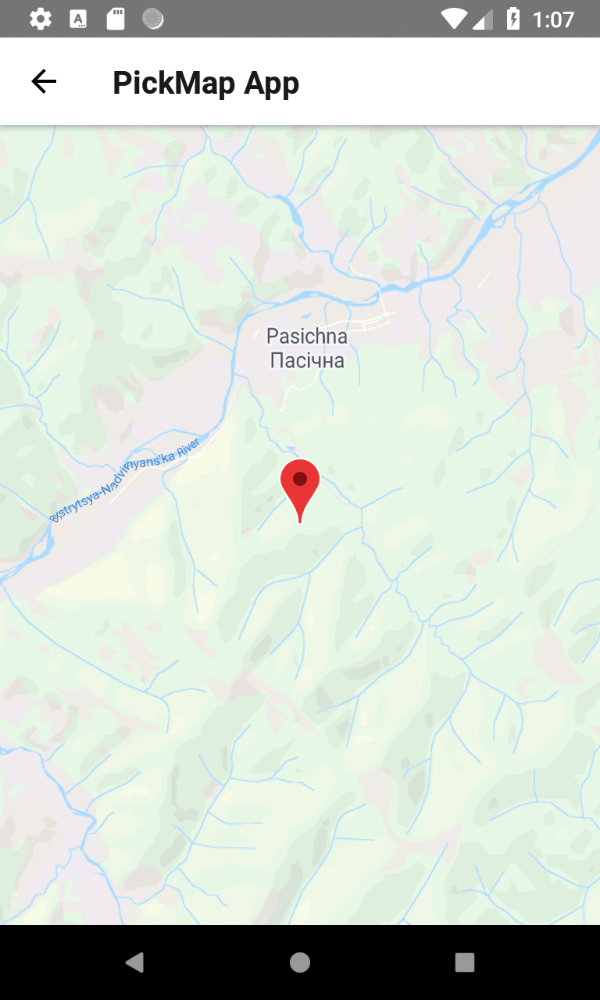

# PickPhotoMap
This app for capture photo from camera/get an image from the gallery and get GPS coordinates (show on a map).

Technologies, elements and libraries used when writing an application:
JavaScript, React Native, Redux, Redux Thunk, Navigation, Geolocation, Maps, ImagePicker

## View
<table align="left" width="100%">
  <tbody>
      <td colspan="1">  </td>
      <td colspan="2">  </td>
      <td colspan="3">  </td>
      <td colspan="4">  </td>
      <td colspan="5">  </td>
  </tbody>
</table>

## Version
0.01

## How to install
1) Download project from git.
2) Connect your device to the computer or use the emulator.
3) Download and install Node.js (https://nodejs.org/en/download/)
2) Open Command Line in the project directory and run:
#### `npm install`
#### `react-native run-android`
